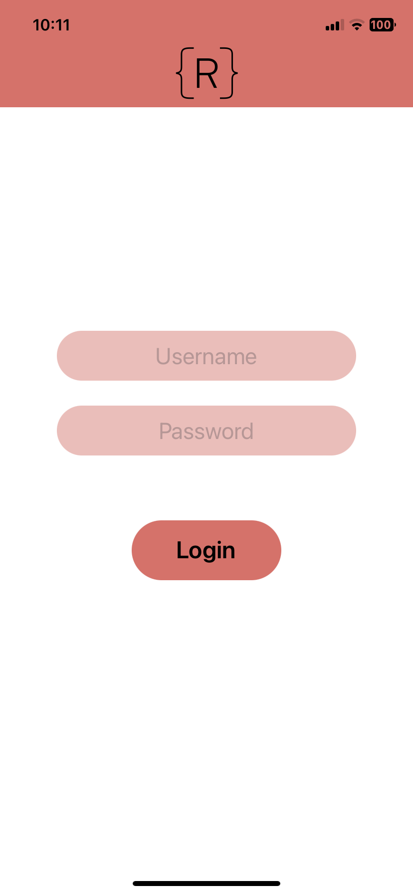
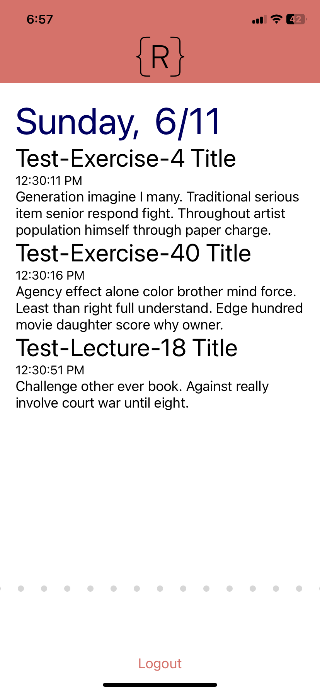

# RithmGo

> A React Native application compatibile with iOS and Android presenting educational events obtained from Rithm Student Information System (SIS) API.

<!-- PROJECT Demo/Bug/Feature links -->
<div align="center">
  <p align="center">
    <br />
    <a href="https://github.com/huseKivrak/RithmGo"><strong>Explore the docs »</strong></a>
    <br />
    <a href="https://github.com/huseKivrak/RithmGo">View Demo</a>
    ·
    <a href="https://github.com/huseKivrak/RithmGo/issues">Report Bug</a>
    ·
    <a href="https://github.com/huseKivrak/RithmGo/issues">Request Feature</a>
    <br />
  </p>
</div>

<!-- PROJECT SHIELDS -->
<!--
*** I'm using markdown "reference style" links for readability.
*** Reference links are enclosed in brackets [ ] instead of parentheses ( ).
*** See the bottom of this document for the declaration of the reference variables
*** for contributors-url, forks-url, etc. This is an optional, concise syntax you may use.
*** https://www.markdownguide.org/basic-syntax/#reference-style-links
-->
[![Contributors][contributors-shield]][contributors-url]
[![Forks][forks-shield]][forks-url]
[![Stargazers][stars-shield]][stars-url]
[![Issues][issues-shield]][issues-url]
[![MIT License][license-shield]][license-url]


<!-- TABLE OF CONTENTS -->
<details>
  <summary>Table of Contents</summary>
  <ol>
    <li>
      <a href="#about-the-project">About The Project</a>
      <ul>
        <li><a href="#built-with">Built With</a></li>
      </ul>
    </li>
    <li>
      <a href="#getting-started">Getting Started</a>
    </li>
    <li><a href="#usage">Usage</a></li>
    <li><a href="#roadmap">Roadmap</a></li>
    <li><a href="#contributing">Contributing</a></li>
    <li><a href="#license">License</a></li>
    <li><a href="#contact">Contact</a></li>
    <li><a href="#acknowledgments">Acknowledgments</a></li>
  </ol>
</details>


<!-- ABOUT THE PROJECT -->
## About The Project

This mobile app was designed around displaying lectures, exercises, and events from Rithm School's full stack software engineering program in daily digests.

The app loads the exercises for the current date, and the user can swipe left to see the previous day's activities, or swipe right to see the next days' activities.

<p align="right">(<a href="#RithmGo">back to top</a>)</p>

### Built With
<br />

* [![React-Native][React-Native.js]][React-Native-url]


<p align="right">(<a href="#RithmGo">back to top</a>)</p>

<!-- GETTING STARTED -->
## Getting Started

Note that this application, as written, requires access to Rithm School's SIS. A demo of the program was recorded to view the application features for those without access to this API.

1. Install all dependencies:
```shell
npm install
```

2. Run the app:
```shell
npx expo start
```

Note: Both front and back end development servers must be running on the machine IP address - not 'localhost'.


<p align="right">(<a href="#RithmGo">back to top</a>)</p>

<!-- USAGE EXAMPLES -->
## Usage

<div style="display: flex; gap: 20px;">


</div>

<p align="right">(<a href="#RithmGo">back to top</a>)</p>

<!-- ROADMAP -->
## Roadmap

- [ ] Add Tests
- [ ] Loading bracket animation

See the [open issues](https://github.com/huseKivrak/RithmGo/issues) for a full list of proposed features (and known issues).

<p align="right">(<a href="#RithmGo">back to top</a>)</p>


<!-- CONTRIBUTING -->
## Contributing

Contributions are what make the open source community such an amazing place to learn, inspire, and create. Any contributions you make are **greatly appreciated**.

If you have a suggestion that would make this better, please fork the repo and create a pull request. You can also simply open an issue with the tag "enhancement".
Don't forget to give the project a star! Thanks again!

1. Fork the Project
2. Create your Feature Branch (`git checkout -b feature/AmazingFeature`)
3. Commit your Changes (`git commit -m 'Add some AmazingFeature'`)
4. Push to the Branch (`git push origin feature/AmazingFeature`)
5. Open a Pull Request

<p align="right">(<a href="#RithmGo">back to top</a>)</p>


<!-- LICENSE -->
## License

Distributed under the MIT License. See `LICENSE.txt` for more information.

<p align="right">(<a href="#RithmGo">back to top</a>)</p>


<!-- CONTACT -->
## Contact

Huse Kivrak - [huse.dev](huse.dev) - [LinkedIn](https://www.linkedin.com/in/husekivrak/)

<p align="right">(<a href="#RithmGo">back to top</a>)</p>


<!-- ACKNOWLEDGMENTS -->
## Acknowledgments

* [Co-Creator: Ari Denary](https://github.com/ari-denary)

<p align="right">(<a href="#RithmGo">back to top</a>)</p>


<!-- MARKDOWN LINKS & IMAGES -->
<!-- https://www.markdownguide.org/basic-syntax/#reference-style-links -->
[contributors-shield]: https://img.shields.io/github/contributors/huseKivrak/RithmGo.svg?style=for-the-badge
[contributors-url]: https://github.com/huseKivrak/RithmGo/graphs/contributors
[forks-shield]: https://img.shields.io/github/forks/huseKivrak/RithmGo.svg?style=for-the-badge
[forks-url]: https://github.com/huseKivrak/RithmGo/network/members
[stars-shield]: https://img.shields.io/github/stars/huseKivrak/RithmGo.svg?style=for-the-badge
[stars-url]: https://github.com/huseKivrak/RithmGo/stargazers
[issues-shield]: https://img.shields.io/github/issues/huseKivrak/RithmGo.svg?style=for-the-badge
[issues-url]: https://github.com/huseKivrak/RithmGo/issues
[license-shield]: https://img.shields.io/badge/License-MIT-41acc0?style=for-the-badge&logo=MIT&logoColor=white
[license-url]: https://github.com/huseKivrak/RithmGo/blob/main/LICENSE.txt
[React-Native.js]: https://img.shields.io/badge/React_Native-20232A?style=for-the-badge&logo=react&logoColor=61DAFB
[React-Native-url]: https://reactnative.dev/
